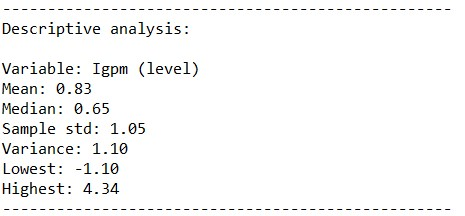

# **DESCRIPTION**
IGPM is a monthly price indicator used to measure inflation (price increase) and is composed by the weighting of 3 other indices: IPA 60%, IPC 30% and INCC 10%. It is calculated by a private institution: Fundação Getúlio Vargas (FGV).
These indicators measure items such as consumer goods (an example is food) and production goods (raw materials, construction materials, among others). Included, in addition to other components, are the prices of vegetables and fruits, beverages and tobacco, medicines, packaging, rent, condominium, maid, transport, education, reading and recreation, clothing and miscellaneous expenses (notary office, lottery, mail, monthly fee of Internet and cigarettes, among others).

Source: http://www.ipeadata.gov.br/ExibeSerie.aspx?stub=1&serid37796=37796&serid364%2082=36482

# **RESULTS**
Results obtained through the model estimation process.

## Variable analysis at level:
    

    

    

    

## Study of data stationarity:
    

    

## SEASONAL ADJUSTMENT:
    

    

## Model results:
    

## Residual analysis:
    

    

    

# Forecast:
    
